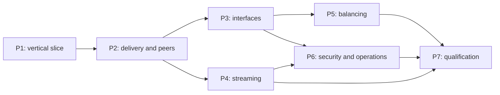

# moonpool-rpc implementation plan

Build a fresh, functionally rich Rust RPC stack inspired by FoundationDB fdbrpc on Moonpool providers. Dynamic service incarnations, transportable interfaces, reply promises, delivery modes, failure monitoring, streaming/credit, load balancing and operational/security contracts are first-class. Native RPC uses TCP directly; it is not an HTTP/2 layer or a restoration of moonpool-transport.

**Tracking issue:** [#212](https://github.com/PierreZ/moonpool/issues/212). GitHub issues are the execution source of truth. [Architecture](architecture.md) records decisions; [parity](parity.md) maps observable contracts to exact source anchors and owning issues. No implementation or placeholder crate is created by this planning change.

## Source baseline

- Moonpool: `70bc7d6317a76f337cbce0835cf6e63bb4070821` in `PierreZ/moonpool`.
- FoundationDB: `c0c44752df676e4a2d532b5cdb4bf96728a30b78` at `$HOME/workspace/cpp/foundationdb` (primary behavioral source).
- Both checkouts were clean at reconnaissance and clarification. Two unrelated untracked audit tests appeared during planning: `crates/moonpool-sim/tests/audit_storage_repro.rs` and `audit_turmoil_network.rs`; they were left untouched. Only the three files in this directory are added by this task; FDB is unmodified. Baseline tests use a temporary archive of the recorded Moonpool SHA to avoid mixing concurrent audit work into the result.
- Historical analysis revision: `ed4f3381b28bcad421493abfeaa3997159146143`; historical dynamic-endpoint example: `f3b61d7fc900722ee0999e4ee6ad5e8cf7816838`. Neither is a current implementation base.
- Read root/crate AGENTS.md, workspace/features, provider/select/metrics code, process/fault/network/executor/replay code, hyper lifetime/clock integration, xtask's explicit registry and all current GitHub Actions workflows. Retained FDB files were enumerated and compared; material discrepancies are listed in parity.md.

## Settled decisions

- Explicit typed service references, request receivers and reply handles; optional generated conveniences after the manual API is proven.
- Rust-defined messages, an established bounded codec, stable explicit schema/method IDs and tested protocol/schema evolution. Codec selection closes in the first package.
- Support only Moonpool's existing platforms and providers; follow its Tokio and native/wasm feature boundaries. RPC adds no independent platform commitment.
- Internal ordering, cooperative fairness, hard resource limits and reserved control capacity; no full Flow scheduler.
- Definitively stale dynamic endpoints fail promptly, preserving execution ambiguity. Learning a new incarnation is explicit application action.
- User deferred **mTLS**. The accepted remaining security proposal covers server-authenticated TLS, public/private policy, per-request verification, JWT/JWKS verification and rotation. No client-certificate authentication gate or internet-scale multi-tenant promise.
- Improvements to Moonpool providers/simulation are authorized when RPC exposes a genuine gap. Reusable abstractions may enter core with explicit justification; RPC-specific state stays in RPC. No improvements are implemented during this planning task.
- Flat crates: moonpool-rpc, optional moonpool-rpc-derive, non-published moonpool-rpc-sim. Production never depends on sim. Hyper stays independent; facade RPC support is optional.

## Scope and exclusions

The complete agreed RPC/transport scope is distributed through seven executable packages below. mTLS is explicitly deferred. FDB binary compatibility, Flow serialization/layout/history, actors, membership, Paxos/workflows, durable delivery, exactly-once, transparent incarnation refresh and stream resumption are excluded. Application identity, fencing, durable continuity, token issuance and permission meaning remain application concerns. Existing provider/simulation capabilities replace the corresponding FDB runtime components. Every exclusion is classified in parity.md.

## Work packages and dependencies

Each row is **one substantial PR**, with multiple coherent local commits and tests before remote CI. Dependencies below are code and merge dependencies; CI gates merge, not all subsequent local work.

| Order | Issue / executable outcome | Code and merge predecessors | Work possible alongside it |
|---|---|---|---|
| 1 | [#213](https://github.com/PierreZ/moonpool/issues/213) — dynamic typed request/reply on real TCP and simulation | None; immediately executable | Security/codec investigation and oracle design |
| 2 | [#214](https://github.com/PierreZ/moonpool/issues/214) — peer recovery, delivery semantics and failure monitoring | [#213](https://github.com/PierreZ/moonpool/issues/213) | P3/P4 from verified P2 while its CI runs |
| 3 | [#215](https://github.com/PierreZ/moonpool/issues/215) — interface exchange, same-address reboot/recruitment and derives | [#214](https://github.com/PierreZ/moonpool/issues/214) | P4 |
| 4 | [#216](https://github.com/PierreZ/moonpool/issues/216) — streaming, credit, scheduling and resource control | [#214](https://github.com/PierreZ/moonpool/issues/214) | P3, then P5 |
| 5 | [#217](https://github.com/PierreZ/moonpool/issues/217) — locality/load balancing and explicit retry/hedging | [#215](https://github.com/PierreZ/moonpool/issues/215) | P4/P6 |
| 6 | [#218](https://github.com/PierreZ/moonpool/issues/218) — security excluding mTLS, upgrades and operations | [#215](https://github.com/PierreZ/moonpool/issues/215), [#216](https://github.com/PierreZ/moonpool/issues/216) | P5; adapter/fixture work can start after P1 |
| 7 | [#219](https://github.com/PierreZ/moonpool/issues/219) — combined qualification, performance and readiness | [#216](https://github.com/PierreZ/moonpool/issues/216), [#217](https://github.com/PierreZ/moonpool/issues/217), [#218](https://github.com/PierreZ/moonpool/issues/218) | Early independent oracle/campaign design |

Package labels in the graph map directly to the real issue links above. There is no dependency cycle. Investigation choices are bounded checkpoints inside their implementation packages; no additional investigation issues or micro-issue chain is needed.

## Slow-CI execution policy

The issue lead makes several coherent commits, runs focused tests, completes package-level checks and deterministic campaigns, obtains independent review, then opens one substantial PR. Internal checklist items never require individual PR/merge cycles. Every issue includes concrete commands, behavioral oracles, required fault scenarios and resource/lifetime checks.

A successor may branch from a predecessor's exact locally complete, independently verified commit while remote CI runs. Record base/predecessor SHAs, review evidence and test configuration. The predecessor must merge before the dependent PR lands. If it changes, update/rebase provisional work, rerun affected tests/campaigns and repeat affected review. Prefer one unmerged prerequisite layer; avoid creating a deep provisional stack. P3/P4, P5/P6 and independent fixture design provide useful concurrent work.

P1 calibrates architecture and effort with a real executable slice; adjust later implementation phases from evidence without removing required capabilities. Tests are distributed throughout; P7 only combines and scales existing validation. Campaigns use legitimate faults, bounded budgets, explicit required hits, semantic replay and the RNG canary. Never disable assertions to obtain green CI.

## Existing backlog and remaining choices

Read-only GitHub searches found no existing moonpool-rpc issue. Closed #61, #169, #174 and #208 supply lessons about observable decode failure, explicit shutdown, supported fault masks and hidden wall-clock dependence. They are not predecessor implementation requirements, and no historical issue was modified. Existing `enhancement`, `simulation` and `foundationdb-inspired` labels are reused; no labels are created.

Codec/frame details (P1), generic resolver shape (P2), measured budgets (P4), security dependencies/upgrade window (P6) and performance acceptance envelope (P7) remain implementation decisions owned by those issues. No further architecture approval gate is required. mTLS remains deferred until separately requested.
